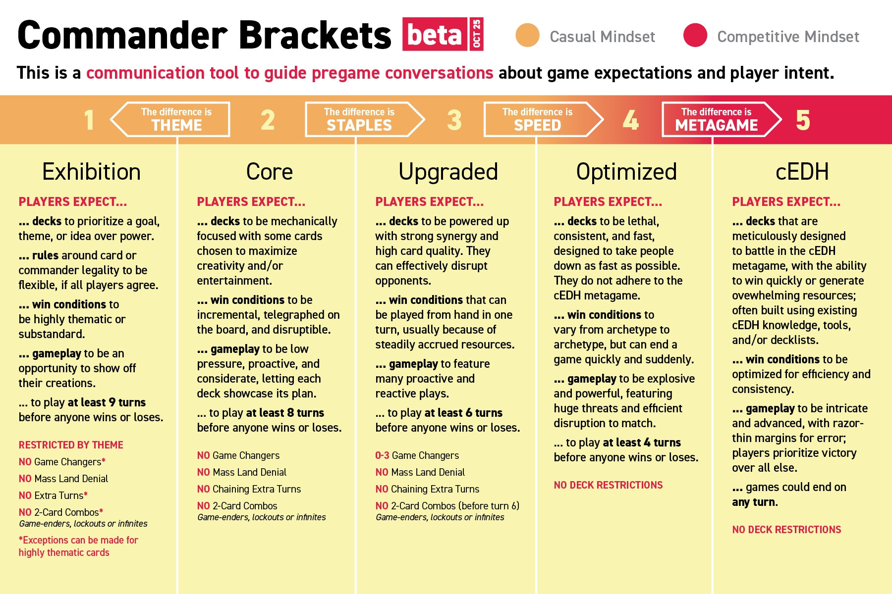

Hey folks! ✌️

A few days ago, [Gavin Verhey](https://magic.wizards.com/en/news/archive?author=5m1u9U8j4A5Q8XLlASAsjK) published on Wizards' official site the article "[Commander Brackets Beta Update – October 21, 2025](https://magic.wizards.com/en/news/announcements/commander-brackets-beta-update-october-21-2025)". With a patch notes vibe, this article describes some changes in the philosophy behind the brackets, updates to the [Game Changer List](https://scryfall.com/search?q=is%3Agc) and leaves some open questions for the community.

> This is an opinion post, with a view of casual tables, mainly brackets 2 and 3. This opinion does not represent Wizards or any specific community, nor is it an absolute truth written in stone.

Let's break down some relevant points and how these changes impact the format.

## Expected turns played

One of the novelties of this update was the addition of an expected number of turns played for each bracket, a very objective way of saying how fast or explosive a match should be.

The current proposal says that, before winning or losing, you can expect to play:

|||
| --------- | ------------------------ |
| Bracket 1 | at least **nine turns**  |
| Bracket 2 | at least **eight turns** |
| Bracket 3 | at least **six turns**   |
| Bracket 4 | at least **four turns**  |

When playing in bracket 5, you expect that the match can **end at any moment**.

> "Oh! So if Wizards releases a broken card with an interaction that ends the game on turn one, it will be valid in cEDH!?"

Yes! A resounding **YES**. There's nothing wrong with that — after all, we're talking about cEDH. If the card is so problematic, it will be banned ~I hope so~.

## Streamlining the Game Changer List

Recapping what Game Changers are:

> Game Changers are cards that can dramatically warp Commander games, allowing players to run away with resources, shift games in ways that many players dislike, block people from play, efficiently search for their strongest cards, or have commanders that tend to take away from more casual games. These cards are a clear signal indicating a different kind of play and that others might prefer not to play against them.
> Bracket 1 and 2 decks exclude Game Changers. Bracket 3 allows for up to three Game Changers. Brackets 4 and 5 allow for unlimited Game Changers. 
> — <cite>Wizards of the Coast[^1]</cite>

[^1]: [Official page](https://magic.wizards.com/en/formats/commander#gamechangers) of the Commander format.

Knowing this, the panel members decided to reduce the number of cards in the list. Which, at the end of the day, ends up simplifying players' lives, gives more deck building options and avoids some redundancies.

### Powerful legends in the command zone

Legends that are powerful only in the command zone are no longer considered Game Changers. With this, [Kinnan, Bonder Prodigy](https://scryfall.com/card/iko/192/kinnan-bonder-prodigy), [Urza, Lord High Artificer](https://scryfall.com/card/cmm/130/urza-lord-high-artificer), [Winota, Joiner of Forces](https://scryfall.com/card/iko/216/winota-joiner-of-forces) and the dreaded [Yuriko, the Tiger's Shadow](https://scryfall.com/card/cmm/364/yuriko-the-tigers-shadow) are leaving the list.

> **Yuriko** is allowed in bracket 2!

Memes and jokes aside, if you consider all the restrictions of each bracket and the simple fact that the commander is what usually "gives name" to the deck, if you really want (or don't want) to play with a certain legend in the command zone, it's very easy to have a conversation about it.

Other cards that are just ~unbearably annoying~ unpleasant to play, like our unbeloved [Grand Arbiter Augustin IV](https://scryfall.com/card/2x2/221/grand-arbiter-augustin-iv), or powerful both in the command zone and in the 99, like [Braids, Cabal Minion](https://scryfall.com/card/mh2/273/braids-cabal-minion) and [Tergrid, God of Fright](https://scryfall.com/card/khm/112/tergrid-god-of-fright-tergrids-lantern), remain on the list.

A relatively simple change, but one that reinforces a very basic point of Commander: it's a collective game — talk before playing and align expectations.

### Cost and reward

Now that we have the expected match duration, it becomes even clearer that, if you cast a spell for eight, nine or ten mana, it's expected to be a high impact spell and **very likely** the game will be heading to the end.

With this in mind, [Expropriate](https://scryfall.com/card/cn2/30/expropriate), [Jin-Gitaxias, Core Augur](https://scryfall.com/card/ima/62/jin-gitaxias-core-augur), [Sway of the Stars](https://scryfall.com/card/bok/54/sway-of-the-stars) and [Vorinclex, Voice of Hunger](https://scryfall.com/card/ima/189/vorinclex-voice-of-hunger) are leaving the Game Changer List. These cards cost between 8 and 10 mana; it's expected that to cast one of them the player spends all their resources or depends on a sequence of cards that enable the play. Therefore, given the high investment, it's expected that they cause significant impact.

> "So there will be Vorinclex decks in bracket 2!?"

Actually, **no**. Although it's not on the list, Vorinclex fits into the _"mass land denial"_ category, like [Armageddon](https://scryfall.com/card/a25/5/armageddon), and this characteristic makes it so it can only enter from bracket 4 onwards. It's important to understand these nuances: the goal of the Game Changer List is not to be redundant with the rules already explicit in each bracket.

### No tutor restrictions for brackets 1 and 2

This is a change worth a standing ovation! Anyone who saw the first version of the brackets encountered the term "few tutors" in brackets 1 and 2, but what exactly does "few tutors" mean? Which cards qualify as tutors? And, after all, how much is considered few?

This kind of recommendation is terrible and doesn't make clear what should be expected. If a card is problematic for these brackets, it should go straight to the Game Changer List. That's why I can only see this change favorably.

## Open discussions

Gavin made sure to leave some "loose ends" in the article, points for the community to reflect on and discuss. In a way, there's at least an attempt to an attempt to listen to the community and seek feedback. It's worth giving it a shot.

### Do you pay the one?

<figure>

<figcaption>

The Command Zone -  Wall Scroll[^2]

</figcaption>
</figure>

[Rhystic Study](https://scryfall.com/card/jmp/169/rhystic-study) is the iconic card that generates endless memes and play interruptions. Just a quick Google Images search for "Do you pay the one?" to understand that this card accumulates love and hate wherever it goes.

Although it's a Game Changer, its potential for constant value generation still seems to keep the panel wondering. Should Rhystic Study be banned?

Although detestable to some, just like its younger sisters [Smothering Tithe](https://scryfall.com/card/cmm/57/smothering-tithe) and [Esper Sentinel](https://scryfall.com/card/mh2/12/esper-sentinel), the panel members seem inclined to believe that the Game Changer List is the appropriate place for these cards.

This seems to be a reasonable decision: these cards have enough power to change the pace of the game, creating a _"soft lock"_ that makes opponents spend more resources on each play ([Augustin IV](https://scryfall.com/card/2x2/221/grand-arbiter-augustin-iv) sends regards), while giving resources to the controller.

> Is Commander more fun with Rhystic Study?

For many people, probably the answer is **yes**. As much as some ~like me~ despise this card to the depths of their hearts, Rhystic Study is iconic and probably many people's favorite card; it's part of the format's culture.

[^2]: ["Do You Pay The One?" Wall Scroll](https://store.commandzone.com/products/do-you-pay-the-one-wall-scroll) Command Zone Store

On this topic, I would like to give an honorable (or dishonorable?) mention to [Charismatic Conqueror](https://scryfall.com/card/lcc/70/charismatic-conqueror), another card with similar design. Although it doesn't generate a direct resource advantage — rather, board presence with creature tokens, this card also generates constant interruption on each action. This type of mechanic naturally forces slower matches by adding a decision layer to each play and perhaps should stay away from lower brackets.

### Thassa's Saturation

One of the most common win conditions (if not the most common) in bracket 4 and cEDH decks is [Thassa's Oracle](https://scryfall.com/card/thb/73/thassas-oracle), mainly in combination with [Demonic Consultation](https://scryfall.com/card/mb2/181/demonic-consultation), [Tainted Pact](https://scryfall.com/card/sta/33/tainted-pact) or [Doomsday](https://scryfall.com/card/a25/88/doomsday). Whoever has never heard of this card probably hasn't had contact with more competitive formats — and that's okay.

The point here is different from the Rhystic Study case: the open question is how much this card is present at more casual tables and, if so, how "oppressive" it should be. Are casual games being interrupted prematurely by a Thassa's Oracle combo?

Although it's a laudable question from the panel, the problem with this card seems a bit different. In casual tables, without the other combo pieces, Thassa's Oracle seems just tedious. Remembering that, being a Game Changer, the most casual possible is bracket 3, so its real presence is in brackets 4 and 5, which ~at least in theory~ shouldn't worry so much about explosive and oppressive plays. Is a match ending on turn 6 with Thassa's Oracle really that concerning?

If Thassa's Oracle is banned, the biggest impact will be on competitive formats, which may gain more variety. Either way, decisions about this card's future should be aligned with the environment in which it's used, and not just a specific bracket where it doesn't seem to be the most viable win condition.

### More granularity between brackets

The article mentions the possibility of creating a new bracket between 2 and 3 or between 3 and 4 to provide more granularity.

It's almost obvious that bracket 3 tends to be the most populous: it's more accessible to newcomers, but already brings a spirit of deck building and personalization, which is the true identity of casual commander. Naturally, over time, players who join commander should end up migrating to this bracket as they identify with a deck or playstyle.

Think of someone who started playing with a preconstructed deck, learned the rules and now wants to create their own deck — this person will most likely fall into bracket 3.

More granularity, in this aspect, means player segmentation, potentially making it even harder for those who don't seek something "super optimized" and just want to have fun to find the right table.

### Allow hybrid mana in construction

This seems to be a point that divided opinions and is worth debating. As this is an opinion article, let's start with the opinion:

The article says:

> In Magic, hybrid cards are made to be playable by either color. That's how they work in all of Magic: if I have a [Kitchen Finks](https://scryfall.com/card/uma/216/kitchen-finks), I can put it in my mono-white deck or my mono-green deck. Commander is a place where it's the opposite: you can't put it in either a mono-white or mono-green deck!

This statement is accurate, but there's a reason for this: Commander introduces the concept of **color identity** as an **intentional** limitation in deck building.

This limitation forces players to seek different options, instead of always opting for the same cards. The more permissive the construction, the more similar decks tend to become.

And let's face it, it's not exactly simple to explain to new players the difference between card color and card color identity...

Raising this topic now seems directly linked to the first set of 2026, [Lorwyn Eclipsed](https://magic.wizards.com/en/products/lorwyn-eclipsed), which will bring more hybrid mana cards to the format.

With exponential _power creep_ and increasingly shorter time between sets, allowing hybrid mana while ignoring color identity in construction tends to create a legion of generically good cards that can fit into countless decks. What at first glance seems like freedom may end up making decks more repetitive.

## And how Commander stands in 2026

Overall, the conclusion we can draw from this article and the changes to the format is that the panel members really tried to refine the brackets into something clearer and more objective, which is great. I believe the purpose of a group like this is to make the game more transparent, without complicating or limiting players' creativity.

It's positive to see that open ideas are being shared with the community before being implemented, avoiding unpleasant surprises whenever possible.

Even with the impression that Commander has been "somewhat sidelined" in recent sets, reading this article is a subtle breath of hope that there are still attentive eyes on the format that has conquered so many players.

To finish, I'll leave the graphic summary[^3] created by [Rachel Weeks](https://bsky.app/profile/wachelreeks.com).

[^3]: [Rachel Weeks' Bluesky post](https://bsky.app/profile/wachelreeks.com/post/3m3ptspaivs27) sharing the brackets update

---
