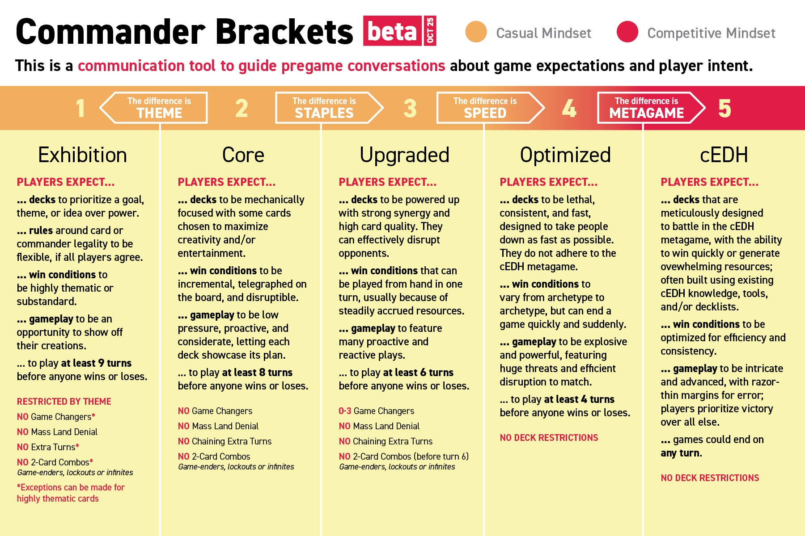

¡Hola gente! ✌️

Hace unos días, [Gavin Verhey](https://magic.wizards.com/en/news/archive?author=5m1u9U8j4A5Q8XLlASAsjK) publicó en el sitio oficial de Wizards el artículo "[Commander Grupos Beta Update – October 21, 2025](https://magic.wizards.com/en/news/announcements/commander-brackets-beta-update-october-21-2025)". Con un aire de notas de parche, este artículo describe algunos cambios en la filosofía de los grupos, actualización en la [Lista de Cartas Decisivas](https://scryfall.com/search?q=is%3Agc) y deja algunas preguntas abiertas para la comunidad.

> Este es un post de opinión, con una visión de mesas casuales, principalmente grupos 2 y 3. Esta opinión no representa a Wizards o ninguna comunidad específica, tampoco es una verdad absoluta escrita en piedra.

Vamos a desmenuzar algunos puntos relevantes de estos cambios y cómo esto impacta el formato.

## Expectativa de turnos jugados

Una de las novedades de esta actualización fue la adición de una expectativa de turnos jugados para cada grupo, una manera muy objetiva de decir qué tan rápida o explosiva debe ser una partida.

La propuesta actual dice que, antes de ganar o perder, esperas jugar por:

|||
| --------- | ------------------------ |
| Grupo 1 | al menos **nueve turnos**  |
| Grupo 2 | al menos **ocho turnos**   |
| Grupo 3 | al menos **seis turnos**   |
| Grupo 4 | al menos **cuatro turnos** |

Ya al jugar en el grupo 5, esperas que la partida pueda **terminar en cualquier momento**.

> "¡Ah! ¿Quiere decir que si Wizards lanza una carta rota con una interacción que termina el juego en el turno uno, va a ser válida en el cEDH!?"

¡Sí! Un sonoro y retumbante **SÍ**. No hay nada de malo con eso — al fin y al cabo estamos hablando de cEDH. Si la carta es tan problemática, será prohibida ~así espero~.

## Simplificando la Lista de Cartas Decisivas

Recapitulando qué son las cartas decisivas:

> Las cartas decisivas alteran drásticamente las sesiones de Commander y permiten que los jugadores obtengan muchos recursos, distorsionen la situación de formas que fastidian a mucha gente, impidan jugar a los demás, busquen sus mejores cartas o usen comandantes que suelen perjudicar los ambientes más informales. Estas cartas son una señal explícita de la forma de jugar y sirven para que otros jugadores se piensen si quieren enfrentarse a ellas. 
> Los mazos del grupo uno y dos no pueden tener cartas decisivas. Los del grupo tres pueden tener hasta tres cartas decisivas. En los grupos cuatro y cinco se permiten todas las cartas decisivas que quieras.   
> — <cite>Wizards of the Coast[^1]</cite>

[^1]: [Página oficial](https://magic.wizards.com/es/formats/commander#gamechangers) del formato Commander.

Sabiendo esto, los miembros del panel decidieron reducir el volumen de cartas en la lista. Lo que, al final del día, termina simplificando la vida de los jugadores, da más opciones de montaje de mazo y evita algunas redundancias.

### Leyendas poderosas en la zona de comando

Leyendas que son poderosas únicamente en la zona de comando ya no son consideradas cartas decisivas. Con esto, [Kinnan, Bonder Prodigy](https://scryfall.com/card/iko/192/kinnan-bonder-prodigy), [Urza, Lord High Artificer](https://scryfall.com/card/cmm/130/urza-lord-high-artificer), [Winota, Joiner of Forces](https://scryfall.com/card/iko/216/winota-joiner-of-forces) y la temida [Yuriko, the Tiger's Shadow](https://scryfall.com/card/cmm/364/yuriko-the-tigers-shadow) salen de la lista.

> ¡Está permitido **Yuriko** en el grupo 2!

Memes y bromas a parte, si consideras todas las restricciones de cada grupo y el simple hecho de que el comandante es el que suele "dar nombre" al mazo, si realmente quieres (o no) jugar con una determinada leyenda en la zona de comando, es muy fácil tener una conversación sobre eso.

Otras cartas que son solo ~insoportablemente molestas~ desagradables de jugar, como nuestro no querido [Grand Arbiter Augustin IV](https://scryfall.com/card/2x2/221/grand-arbiter-augustin-iv), o poderosas tanto en la zona de comando como en las 99, como [Braids, Cabal Minion](https://scryfall.com/card/mh2/273/braids-cabal-minion) y [Tergrid, God of Fright](https://scryfall.com/card/khm/112/tergrid-god-of-fright-tergrids-lantern), continúan en la lista.

Un cambio relativamente simple, pero que refuerza un punto muy básico del Commander: es un juego colectivo — conversen antes de jugar y alineen las expectativas de los mazos.

### Coste y recompensa

Ahora que tenemos la expectativa de duración del partido, queda aún más claro que, si haces una hechizos de ocho, nueve o diez maná, se espera que sea un hechizo de gran impacto y **muy probablemente** el juego estará encaminándose al final.

Con esto en mente, [Expropriate](https://scryfall.com/card/cn2/30/expropriate), [Jin-Gitaxias, Core Augur](https://scryfall.com/card/ima/62/jin-gitaxias-core-augur), [Sway of the Stars](https://scryfall.com/card/bok/54/sway-of-the-stars) y [Vorinclex, Voice of Hunger](https://scryfall.com/card/ima/189/vorinclex-voice-of-hunger) están dejando la Lista de Cartas Decisivas. Estas cartas tienen coste entre 8 y 10 manás; se espera que, para conjurar una de ellas, el jugador gaste todos sus recursos o dependa de una secuencia de cartas que viabilice la jugada. Por lo tanto, dada la alta inversión, es esperado que causen un alto impacto.

> "¿Quiere decir que va a haber mazo de Vorinclex en el grupo 2!?"

En realidad, **no**. Aunque no forma parte de la lista, Vorinclex se encaja en la categoría de _"mass land denial"_ (negación de tierras en masa), así como [Armageddon](https://scryfall.com/card/a25/5/armageddon), y esta característica hace que solo pueda entrar a partir del grupo 4. Es importante entender estos pequeños matices: el objetivo de la Lista de Cartas Decisivas no es ser una redundancia de las reglas ya explícitas en cada grupo.

### Sin restricción de tutores para los grupos 1 y 2

¡Este es un cambio de aplaudir en pie! Quien vio la primera versión de los grupos se topó con el término "few tutors" en los grupos 1 y 2, pero ¿qué significa exactamente "pocos tutores"? ¿Qué cartas se encajan como tutor? Y, al fin, ¿cuánto es considerado poco?

Este tipo de recomendación tan vaga es pésima y no deja claro qué se debe esperar. Si una carta es problemática para estos grupos, que vaya directo para la Lista de Cartas Decisivas. Por eso, solo puedo ver esta mudanza con buenos ojos.

## Discusiones en abierto

Gavin se encargó de dejar algunas "puntas sueltas" en el artículo, puntos para la comunidad reflexionar y discutir. De cierta forma, existe al menos una tentativa de oír más a la comunidad y buscar feedback. Vale la pena darle una oportunidad.

### ¿Vas a pagar 1?

<figure>

<figcaption>

The Command Zone -  Wall Scroll[^2]

</figcaption>
</figure>

[Rhystic Study](https://scryfall.com/card/jmp/169/rhystic-study) es la icónica carta generadora de infinitos memes e interrupciones de jugadas. Basta una rápida búsqueda en Google Imágenes por "Do you pay the one?" para entender que esta carta acumula amor y odio por donde pasa.

Aunque sea una carta decisiva, su potencial de generación de valor constante aún parece dejar al panel con la pulga detrás de la oreja. ¿Rhystic Study debería ser prohibida?

Aunque sea detestable para algunos, así como sus hermanas más nuevas [Smothering Tithe](https://scryfall.com/card/cmm/57/smothering-tithe) y [Esper Sentinel](https://scryfall.com/card/mh2/12/esper-sentinel), los miembros del panel parecen estar inclinados a creer que la Lista de Cartas Decisivas sea el lugar adecuado para estas cartas.

Esta parece ser una decisión razonable: estas cartas tienen poder suficiente para cambiar el ritmo del juego, generando una "soft lock" que hace los oponentes gastar más recursos en cada jugada ([Augustin IV](https://scryfall.com/card/2x2/221/grand-arbiter-augustin-iv) mandó recuerdos), mientras dan recursos al controlador.

> ¿Commander es más divertido con Rhystic Study?

Para muchas personas, probablemente la respuesta es **sí**. Por más que algunos ~como yo~ detesten esta carta del más fondo de sus corazones, Rhystic Study es icónica y probablemente la carta favorita de mucha gente; ella hace parte de la cultura del formato.

[^2]: ["Do You Pay The One?" Wall Scroll](https://store.commandzone.com/products/do-you-pay-the-one-wall-scroll) Command Zone Store

En este tópico, me gustaría hacer una mención honrosa (¿o sería deshonrosa?) a [Charismatic Conqueror](https://scryfall.com/card/lcc/70/charismatic-conqueror), otra carta con diseño semejante. Aunque no genere una ventaja directa en recursos, sino en presencia de campo con fichas de criaturas, esta carta también genera una interrupción constante a cada acción. Este tipo de mecánica fuerza partidos naturalmente más lentos al añadir una capa de decisión a cada jugada y tal vez debería mantenerse alejada de los grupos más bajos.

### Saturación de Thassa

Una de las condiciones de victoria más comunes (si no la más común) en los mazos de grupo 4 y cEDH es [Thassa's Oracle](https://scryfall.com/card/thb/73/thassas-oracle), principalmente en combinación con [Demonic Consultation](https://scryfall.com/card/mb2/181/demonic-consultation), [Tainted Pact](https://scryfall.com/card/sta/33/tainted-pact) o [Doomsday](https://scryfall.com/card/a25/88/doomsday). Quien nunca oyó hablar de esta carta probablemente no tuvo contacto con los formatos más competitivos — y todo bien.

El punto aquí es diferente del caso de Rhystic Study: la duda en abierto es cuánto esta carta está presente en mesas más casuales y, caso esté, cuán "opresiva" debe ser. ¿Juegos de mesas casuales están siendo interrumpidos prematuramente por un combo de Thassa's Oracle?

Aunque sea un cuestionamiento loable del panel, el problema de esta carta parece ser un poco diferente. En mesas casuales, sin las otras piezas del combo, Thassa's Oracle parece apenas tediosa. Recordando que, por ser una carta decisiva, lo más casual posible es el grupo 3, entonces su real presencia está en los grupos 4 y 5, que ~al menos en teoría~ no deberían preocuparse tanto con jugadas explosivas y opresivas. ¿Una partida terminando en el turno 6 con Thassa's Oracle es realmente algo preocupante?

Si Thassa's Oracle fuera prohibida, el impacto mayor será en los formatos competitivos, que tal vez ganen más variedad. De cualquier forma, decisiones sobre el futuro de esta carta deberían estar alineadas al ambiente en que es usada, y no apenas a un grupo específico donde no parece ser la condición de victoria más viable.

### Más granularidad entre los grupos

El artículo menciona la posibilidad de crear un nuevo grupo entre el 2 y 3 o entre el 3 y 4 para proporcionar más granularidad.

Es casi obvio que el grupo 3 tiende a ser el más populoso: él es más accesible para novatos, pero ya trae un espíritu de construcción de mazo y personalización, que es la verdadera identidad del commander casual. Naturalmente, con el tiempo, los jugadores que entran en el commander deben acabar migrando para ese grupo a medida que se identifican con un mazo o estilo de juego.

Piensa en alguien que empezó a jugar con un pré-montado, aprendió las reglas y ahora quiere crear su propio mazo — muy probablemente esa persona caerá en el grupo 3.

Más granularidad, en ese aspecto, significa segmentación de jugadores, pudiendo dificultar aún más que aquellos que no buscan algo "súper optimizado" y solo quieren divertirse encuentren la mesa correcta.

### Liberar maná híbrido en la construcción

Este parece ser un punto que dividió opiniones y vale la pena ser debatido. Como este es un artículo de opinión, vamos a empezar por la opinión:

El artículo dice:

> En Magic, las cartas híbridas son hechas para ser jugables con cualquiera de los colores. Es así como funcionan en todo Magic: si yo tengo un [Kitchen Finks](https://scryfall.com/card/uma/216/kitchen-finks), puedo ponerlo en mi mazo mono-white o en mi mazo mono-green. En Commander, es lo contrario: ¡no puedes ponerlo en un mazo mono-white ni en un mazo mono-green!

Esta afirmación es precisa, pero hay un motivo para esto: Commander introduce el concepto de **identidad de color** como limitación **intencional** en la construcción de mazos.

Esta limitación obliga a los jugadores a buscar opciones diferentes, en lugar de siempre optar por las mismas cartas. Cuanto más permisiva sea la construcción, más parecidos los mazos tienden a ficar.

Y convenimos, ya no es exactamente simple explicar para nuevos jugadores la diferencia entre color de la carta e identidad de color de la carta...

Levantar este tópico ahora parece estar directamente ligado a la primera colección de 2026, [Lorwyn Eclipsed](https://magic.wizards.com/es-ES/products/lorwyn-eclipsed), que traerá más cartas de maná híbrido para el formato.

Con el _power creep_ exponencial y el tiempo cada vez menor entre colecciones, permitir maná híbrido ignorando la identidad de color en la construcción tiende a crear una legión de cartas genéricamente buenas, que pueden entrar en incontables mazos. Lo que a primera vista parece libertad, puede acabar volviendo los mazos más repetitivos.

## Y cómo queda el commander en 2026

La conclusión que podemos sacar de este artículo y de las mudanzas en el formato es que los miembros del panel realmente intentaron lapidar los grupos para algo más claro y objetivo, lo que es genial. Creo que el propósito de un grupo como ese sea tornar el juego más transparente, sin complicar o limitar la creatividad de los jugadores.

Es positivo ver que ideas aún en abierto están siendo compartidas con la comunidad antes de ser implementadas, evitando sorpresas desagradables siempre que sea posible.

Aún con la impresión de que Commander quedó "medio de lado" en las últimas colecciones, la lectura de este artículo es un sutil soplo de esperanza de que aún existen ojos atentos al formato que conquistó tantos jugadores.

Para finalizar dejo el resumen gráfico[^3] elaborado por [Rachel Weeks](https://bsky.app/profile/wachelreeks.com).

[^3]: [Post de Rachel Weeks en Bluesky](https://bsky.app/profile/wachelreeks.com/post/3m3ptspaivs27) compartiendo la actualización de los grupos

---
